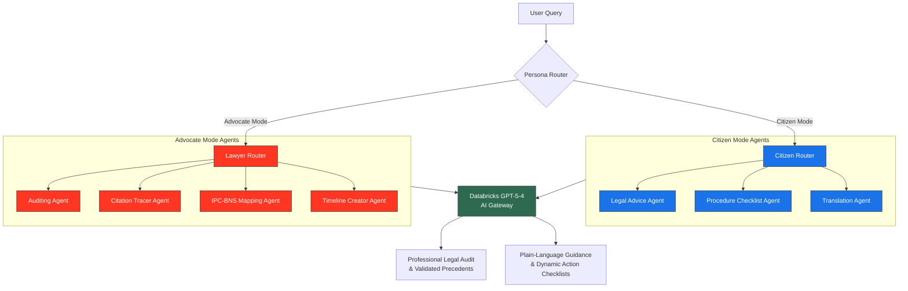

# Nyaya-Sutra — Agentic Legal Intelligence Platform

> **Databricks Native App**
> Powered by Databricks GPT-5-4 · Agent-Driven Legal Workflows · Dual-Mode Interface

## 📖 Project Story & Motivation

Understanding and navigating the complexities of Indian law can be an overwhelming challenge for citizens, while legal professionals often face time-consuming tasks related to legal auditing, tracing citations, and cross-referencing old IPC sections with the new BNS (Bharatiya Nyaya Sanhita). 

**Nyaya-Sutra** was built as a fully-featured, agent-driven legal intelligence platform native to Databricks. It employs a dynamic agentic architecture to serve two distinct personas: Advocates and Citizens. By leveraging high-performance large language models (databricks-gpt-5-4) combined with a structured IPC-to-BNS mapping agent, the platform delivers deep courtroom-grade legal analysis for professionals while simplifying legal procedures into dynamic, state-aware action checklists for everyday citizens.

---

## What is Nyaya-Sutra?

Nyaya-Sutra is an agentic AI legal assistant tailored for the Indian legal framework that features:
- **Dual-Mode Functionality**: 
  - **Advocate Mode**: Deep legal auditing, precedent validation, timeline creation, and citation cross-referencing.
  - **Citizen Mode**: Plain-language legal guidance with actionable, dynamic step-by-step procedure checklists.
- **Agent-Driven Workflow**: Dedicated specialized agents for tasks like citation tracing, legal advice, auditing, translation, and procedure structuring.
- **IPC-to-BNS Mapping**: Agentic translation of historical Indian Penal Code (IPC) cases to the new Bharatiya Nyaya Sanhita (BNS) statutes.
- **Databricks Native**: Fully deployed and orchestrated as a Databricks App using the AI Gateway.

---

## Tech Stack

| Layer | Tool | Purpose |
|---|---|---|
| **LLM** | Databricks GPT-5-4 (via AI Gateway) | Core AI engine powering all specialized agents |
| **Backend** | Python (`app/main.py`) | Agent orchestration, routing, and API serving |
| **Agentic Core** | Custom multi-agent framework | Specialized agents (`audit.py`, `citation_tracer.py`, `ipc_bns_agent.py`, etc.) |
| **Frontend** | React + Vite + TypeScript + Tailwind CSS | Highly responsive, typed single-page application |
| **Deployment** | Databricks Apps (`app.yaml`) | Hosted directly on Databricks workspace infrastructure |

---

## 🏛️ System Architecture & Data Flow



---

## 🗃️ Repository Structure

```text
Nyaya_Sutra/
│
├── app/
│   ├── main.py                     ← Python backend entry point (API server)
│   └── ...                         ← API routes and Databricks endpoints
│
├── src/                            ← Core Agentic Logic & Intelligence
│   ├── audit.py                    ← Legal auditing logic
│   ├── citation_tracer.py          ← Precedent and citation cross-referencing
│   ├── ipc_bns_agent.py            ← IPC to BNS translation logic
│   ├── lawyer_chat_agent.py        ← Advocate mode query handler
│   ├── lawyer_router.py            ← Advocate sub-task router
│   ├── citizen_query.py            ← Citizen mode query handler
│   ├── citizen_router.py           ← Citizen sub-task router
│   ├── legalAdviseAgent.py         ← Plain-language legal advice
│   ├── procedureAgent.py           ← Dynamic procedural checklists
│   ├── timeline_creator_agent.py   ← Event/timeline reconstruction
│   └── translate_agent.py          ← Multilingual translation capabilities
│
├── frontend/                       ← React + Vite SPA
│   ├── src/                        ← React components, hooks, and UI
│   ├── package.json                ← Dependencies (React, Supabase, Tailwind, Lucide)
│   ├── tailwind.config.js          ← Styling configuration
│   └── tsconfig.json               ← TypeScript rules
│
├── app.yaml                        ← Databricks App deployment configuration
└── README.md                       ← Project documentation
```

---

## 🚀 Running on Databricks — Deployment Guide

### STEP 1 — Prerequisites
- Databricks workspace with **Databricks Apps** enabled.
- Access to **Databricks AI Gateway** routing to `databricks-gpt-5-4`.

### STEP 2 — Build the Frontend
Since Databricks Apps streams a Python backend directly but does not build Node projects dynamically, compile the frontend locally before deployment:

```bash
cd frontend
npm install
npm run build
cd ..
```
*Ensure the build artifacts output to the directory configured to be served by `app/main.py`.*

### STEP 3 — Databricks Environment & Gateway Config
Verify `app.yaml` includes the exact base URL and model for native querying. It should look like this:

```yaml
command: ["python", "app/main.py"]

env:
  - name: LLM_BASE_URL
    value: "https://<YOUR_DATABRICKS_GATEWAY_URL>/mlflow/v1"
  - name: MODEL
    value: "databricks-gpt-5-4"
```

### STEP 4 — Deploy the App
1. Clone or pull the repository into your Databricks Workspace (`Workspace → Repos`).
2. Go to **Compute → Apps → Create App**.
3. Point to the Workspace Repository.
4. Set App file to `app.yaml`.
5. Deploy.

### Post-Deployment
- Access the generated Databricks App URL.
- Test both **Citizen** and **Advocate** modes to ensure the agent routers correctly delegate tasks to the specific sub-agents inside `src/`.

---

## Local Development (Testing UI & Agents)

To work on the React UI and Python API concurrently on a local machine:

**1. Start the React Frontend:**
```bash
cd frontend
npm install
npm run dev
# Starts Local Vite server on http://localhost:5173
```

**2. Start the Backend API (Mock or standard LLM endpoint):**
```bash
# Depending on your app framework inside app/main.py
python app/main.py
```
